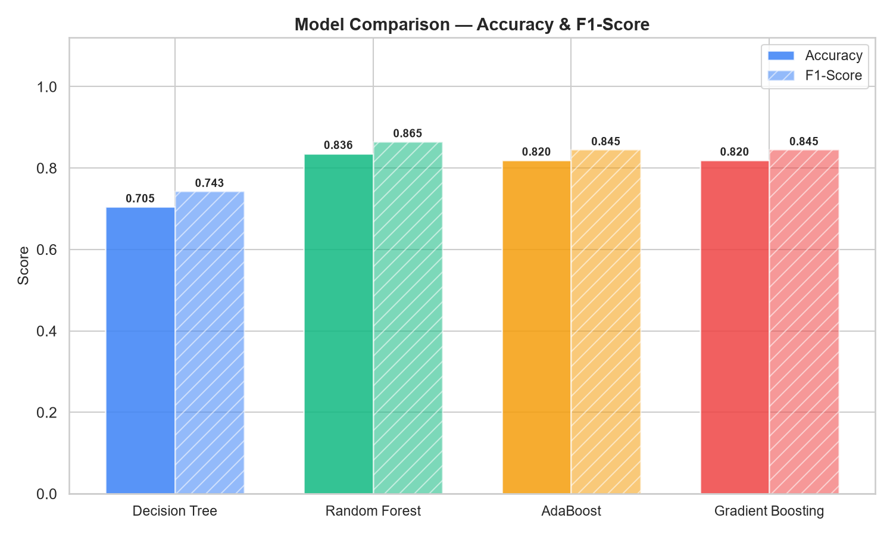
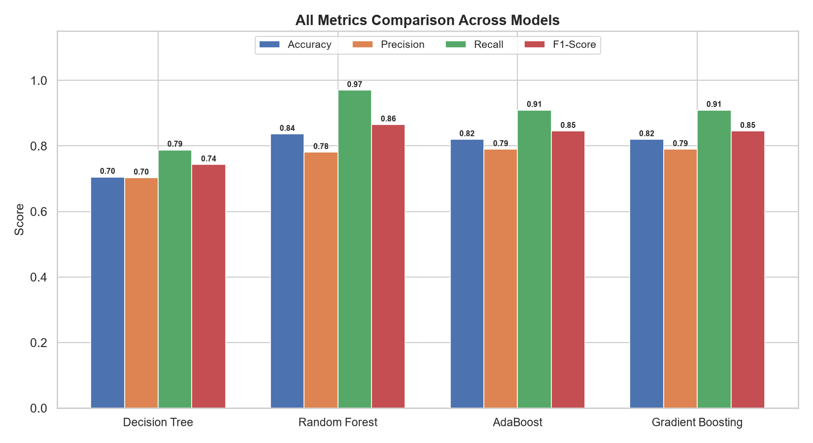
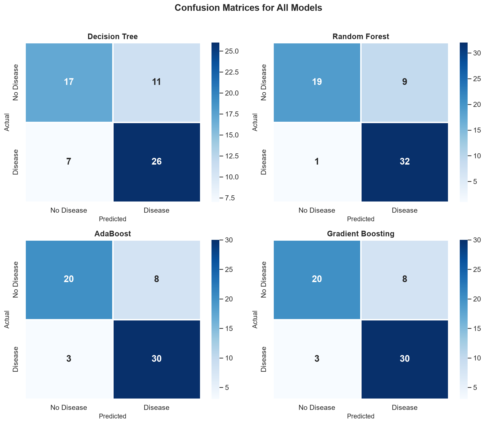
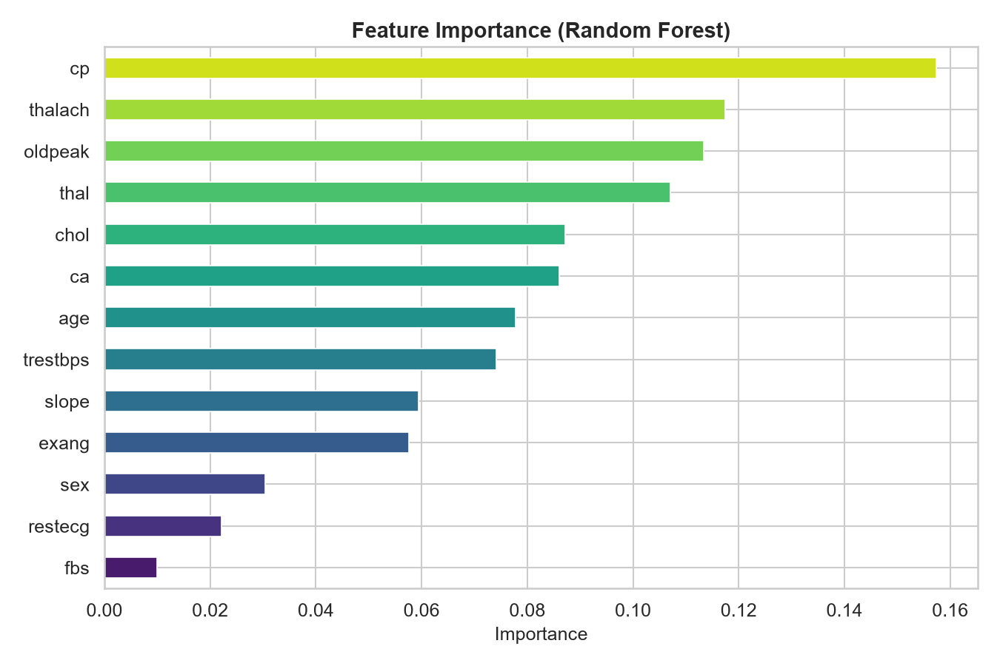
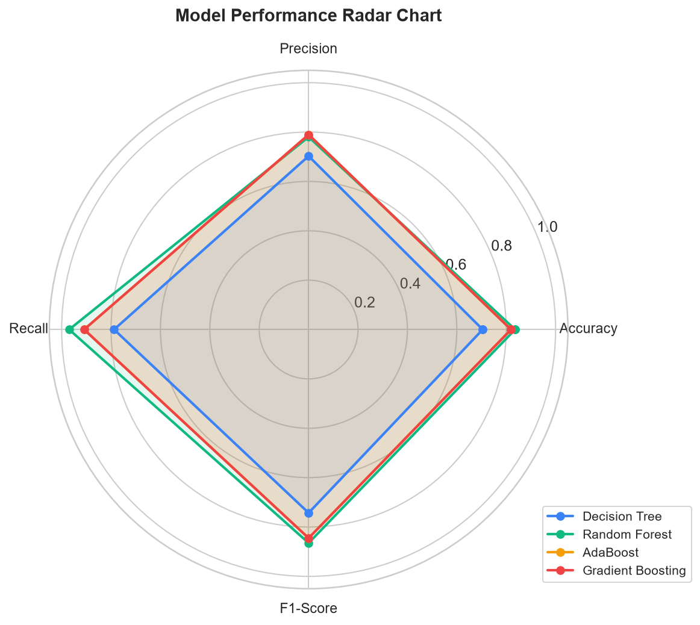

# Heart Disease Prediction ML Project

This project trains and compares multiple machine learning models to predict heart disease from the provided heart attack dataset.

## What it does

- Loads `Heart Attack Data Set.csv`
- Cleans and scales the data
- Splits the dataset into training and test sets
- Trains and compares these classifiers:
  - Decision Tree
  - Random Forest
  - AdaBoost
  - Gradient Boosting
- Prints performance metrics such as accuracy, precision, recall, and F1-score
- Generates visualisations and saves outputs in the `output/` folder

## Project Files

- `heart_disease_ml.py` - main script for training, evaluation, and visualisation
- `Heart Attack Data Set.csv` - dataset used by the model
- `output/` - generated charts and results

## Requirements

- Python 3.9 or later
- pandas
- numpy
- matplotlib
- seaborn
- scikit-learn

## Installation

If you do not already have the dependencies installed, run:

```bash
pip install pandas numpy matplotlib seaborn scikit-learn
```

## How to Run

From the project folder, run:

```bash
python heart_disease_ml.py
```

## Notes

- Make sure `Heart Attack Data Set.csv` stays in the same folder as the Python script.
- The script will create the `output/` folder automatically if it does not already exist.

## Output

When the script runs, it prints dataset information, model comparison results, and patient-level predictions in the terminal. It also creates plots for data exploration and model analysis.

## Generated Charts

### 1. Heart Attack Distribution in Dataset

Bar chart and pie chart showing the class distribution.

<p align="center">
  
</p>

### 2. Model Comparison - Accuracy and F1-Score

Grouped bar chart comparing model accuracy and F1-score.

<p align="center">
  
</p>

### 3. All Metrics Comparison Across Models

Grouped bar chart showing accuracy, precision, recall, and F1-score.

<p align="center">
  
</p>

### 4. Confusion Matrices for All Models

Heatmap chart showing the confusion matrix for each classifier.

<p align="center">
  
</p>

### 5. Feature Importance (Random Forest)

Horizontal bar chart showing the importance of each feature in the Random Forest model.

<p align="center">
  
</p>

### 6. Model Performance Radar Chart

Radar or spider chart comparing all models across the main metrics.

<p align="center">
  
</p>

## Disclaimer

This project is for educational and demonstration purposes only. It should not be used as a medical diagnosis tool.
